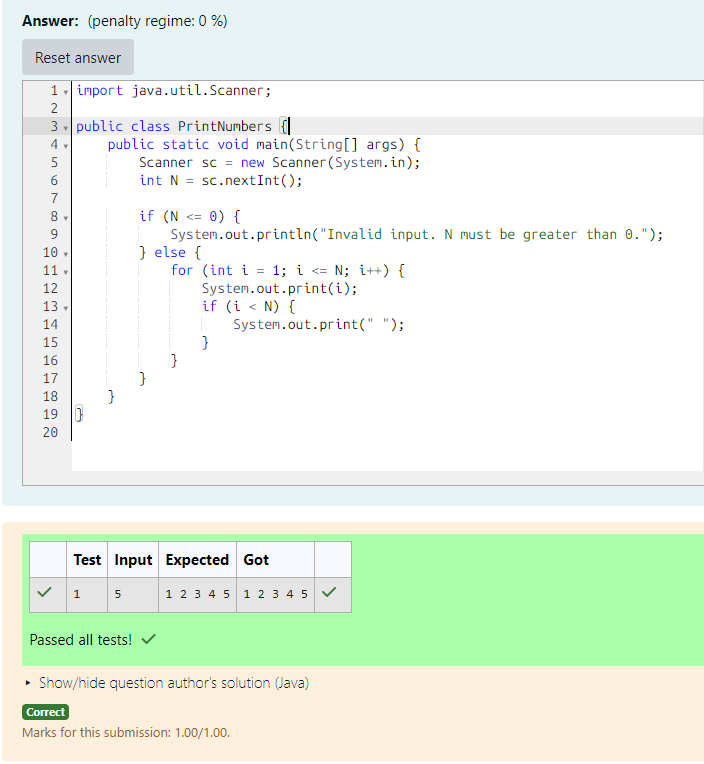

# EX 1A Print All Numbers 

## AIM:
To Write a Java program that takes an integer input N from the user and prints all the numbers from 1 to N, separated by spaces, on a single line..

## Algorithm
1. Start the program and read an integer input N from the user.

2. Check condition:
- If N ≤ 0, display the message "Invalid input. N must be greater than 0" and stop.

3. Initialize loop:
- Set a variable i = 1.

4.  Loop execution:
- Repeat while i ≤ N:

       - Print the value of i.
       - If i < N, print a space.
       - Increment i by 1.

5. End the program after printing all numbers.

## Program:
```java 
/*
Program to implement Reverse a String
Developed by: Junaid Sardar S
Register Number: 212224100028
*/

import java.util.Scanner;

public class PrintNumbers {
    public static void main(String[] args) {
        Scanner sc = new Scanner(System.in);
        int N = sc.nextInt();

        if (N <= 0) {
            System.out.println("Invalid input. N must be greater than 0.");
        } else {
            for (int i = 1; i <= N; i++) {
                System.out.print(i);
                if (i < N) {
                    System.out.print(" ");
                }
            }
        }
    }
}

```

## Output:


## Result:
The program successfully print all the numbers from 1 to N. 
