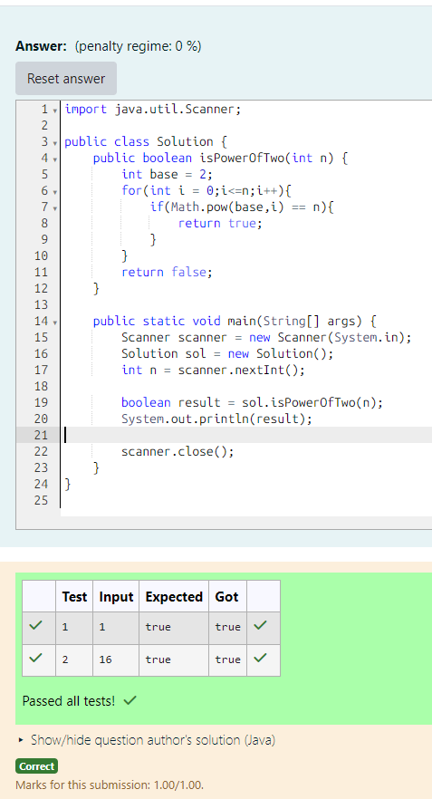

# EX 1B Power of 2

## AIM:
To write a Java program to for given constraints.Given an integer n, return true if it is a power of two. Otherwise, return false.

An integer n is a power of two, if there exists an integer x such that n == 2x.

## Algorithm
1. Start the Program

2. Input the number: Read an integer n from the user.

3. Initialize base value: Set base = 2.

4. Check power condition using loop

    - Run a loop from i = 0 to n
    - For each i, compute 2^i using Math.pow(base, i)
    - If 2^i == n, return true

5. Output result and Stop

    - If no value matches, return false
    - Print the result (true or false)
    - End the program

## Program:
```java
/*
Program to implement Reverse a String
Developed by: Junaid Sardar S
Register Number: 212224100028
*/
import java.util.Scanner;

public class Solution {
    public boolean isPowerOfTwo(int n) {
        int base = 2;
        for(int i = 0;i<=n;i++){
            if(Math.pow(base,i) == n){
                return true;
            }
        }
        return false;
    }

    public static void main(String[] args) {
        Scanner scanner = new Scanner(System.in);
        Solution sol = new Solution();
        int n = scanner.nextInt();

        boolean result = sol.isPowerOfTwo(n);
        System.out.println(result);

        scanner.close();
    }
}
```

## Output:


## Result:
The program successfully implemented and the expected output is verified.
