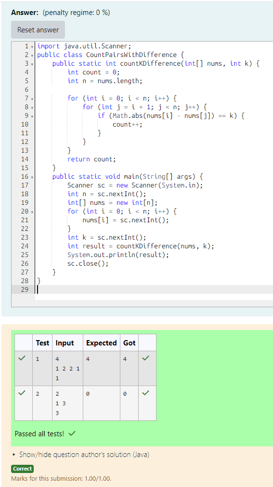

# EX 1C Valid Pairs using Brute Force Approach

## AIM:
To write a Java program to for given constraints.
Given an integer array nums and an integer k, return the number of pairs (i, j) where i < j such that |nums[i] - nums[j]| == k.

The value of |x| is defined as:

x if x >= 0.
-x if x < 0.

## Algorithm

1. Start the Program

2. Input values

   - Read integer n (size of array)
   - Read n elements into array nums
   - Read integer k (required difference)

3. Initialize variables
   - Set count = 0
   - Store array length as n

4. Check all pairs

 - Use two loops:
    - Outer loop: i = 0 to n-1
    - Inner loop: j = i+1 to n-1
 - For each pair (i, j):
    - Calculate |nums[i] - nums[j]|
    - If result equals k, increment count

5. Output result and Stop

    - Print the value of count
    - End the program


## Program:
```java
/*
Program to implement Reverse a String
Developed by: Junaid Sardar S
Register Number: 212224100028
*/
import java.util.Scanner;
public class CountPairsWithDifference {
    public static int countKDifference(int[] nums, int k) {
        int count = 0;
        int n = nums.length;

        for (int i = 0; i < n; i++) {
            for (int j = i + 1; j < n; j++) {
                if (Math.abs(nums[i] - nums[j]) == k) {
                    count++;
                }
            }
        }
        return count;
    }
    public static void main(String[] args) {
        Scanner sc = new Scanner(System.in);
        int n = sc.nextInt();
        int[] nums = new int[n];
        for (int i = 0; i < n; i++) {
            nums[i] = sc.nextInt();
        }
        int k = sc.nextInt();
        int result = countKDifference(nums, k);
        System.out.println(result);
        sc.close();
    }
}
```

## Output:


## Result:
The program successfully implemented and the expected output is verified.
