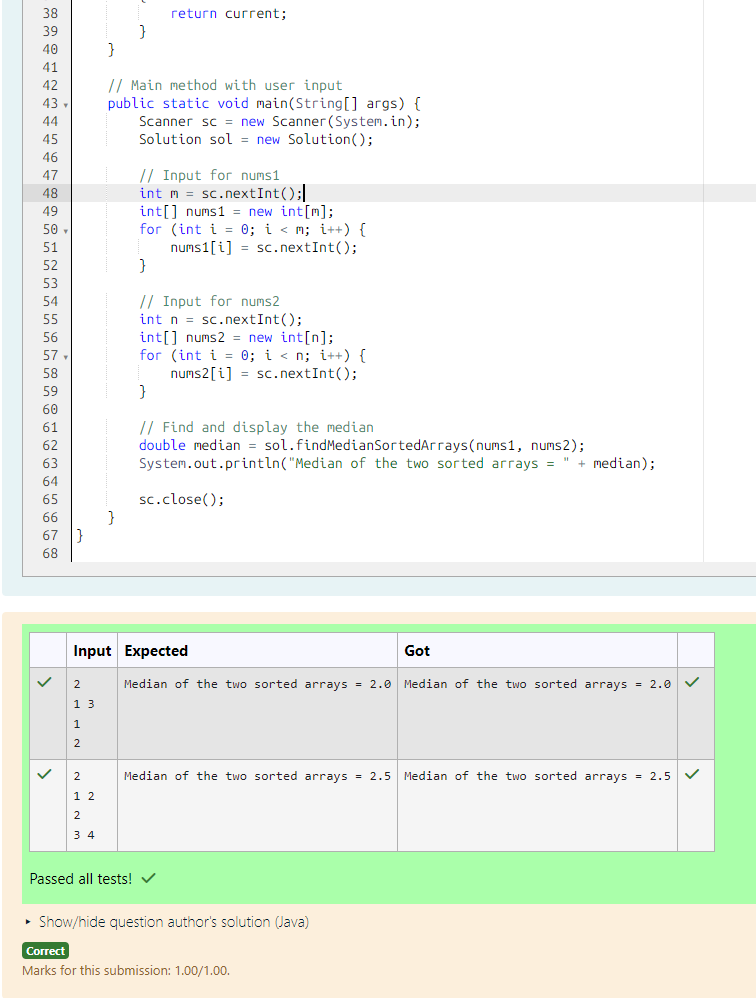

# EX 1D Sorted Array using Divide and Conquer Approach.

## AIM:
To write a Java program to for given constraints.
Given two sorted arrays nums1 and nums2 of size m and n respectively, return the median of the two sorted arrays.

The overall run time complexity should be O(log (m+n)).

## Algorithm
1. Start the Program

2. Input values

    - Read size m and elements of first sorted array nums1
    - Read size n and elements of second sorted array nums2        

3. Initialize variables

    - Set pointers p1 = 0, p2 = 0
    - Calculate totalLength = m + n
    - Find middle indices:
        - mid1 = (totalLength - 1) / 2
        - mid2 = totalLength / 2
    - Initialize current = 0, prev = 0 

4. Traverse and merge till middle

    - Loop from i = 0 to mid2:
        - Store previous value: prev = current
        - Get minimum element from both arrays using getMin()
        - Update current with the selected element
    - getMin() compares elements of both arrays and moves the pointer forward

5. Compute median and Stop

    - If totalLength is even:
        - Median = (prev + current) / 2.0
    - Else:
        - Median = current
    - Print the median
    - End the program 

## Program:
```java
/*
Program to find the median of two sorted arrays
Developed by: Junaid Sardar S
Register Number: 212224100028 
*/
import java.util.Scanner;

public class Solution {
    private int p1 = 0, p2 = 0;
    private int getMin(int[] nums1, int[] nums2) {
        if (p1 < nums1.length && p2 < nums2.length) {
            return nums1[p1] < nums2[p2] ? nums1[p1++] : nums2[p2++];
        } else if (p1 < nums1.length) {
            return nums1[p1++];
        } else if (p2 < nums2.length) {
            return nums2[p2++];
        }
        return -1; 
    }

    public double findMedianSortedArrays(int[] nums1, int[] nums2) {
        int totalLength = nums1.length + nums2.length;
        int mid1 = (totalLength - 1) / 2;
        int mid2 = totalLength / 2;

        int current = 0;
        int prev = 0;
    
        for (int i = 0; i <= mid2; i++) {
            prev = current;
            current = getMin(nums1, nums2);
        }

        if (totalLength % 2 == 0) 
        {
            return (prev + current) / 2.0;
        } 
        else 
        {
            return current;
        }
    }

    public static void main(String[] args) {
        Scanner sc = new Scanner(System.in);
        Solution sol = new Solution();

        int m = sc.nextInt();
        int[] nums1 = new int[m];
        for (int i = 0; i < m; i++) {
            nums1[i] = sc.nextInt();
        }

        int n = sc.nextInt();
        int[] nums2 = new int[n];
        for (int i = 0; i < n; i++) {
            nums2[i] = sc.nextInt();
        }

        double median = sol.findMedianSortedArrays(nums1, nums2);
        System.out.println("Median of the two sorted arrays = " + median);
        
        sc.close();
    }
}
```

## Output:


## Result:
The program successfully implemented and the expected output is verified.
